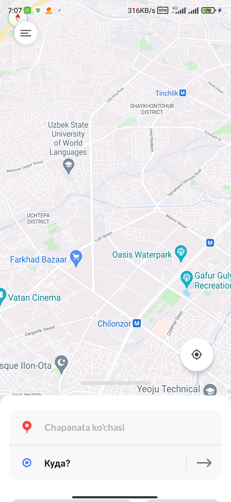
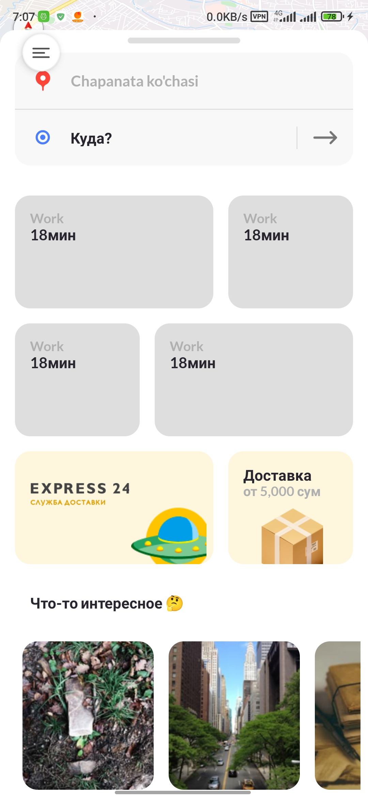
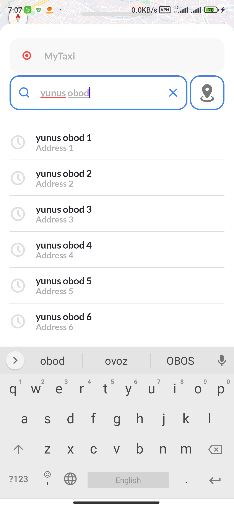
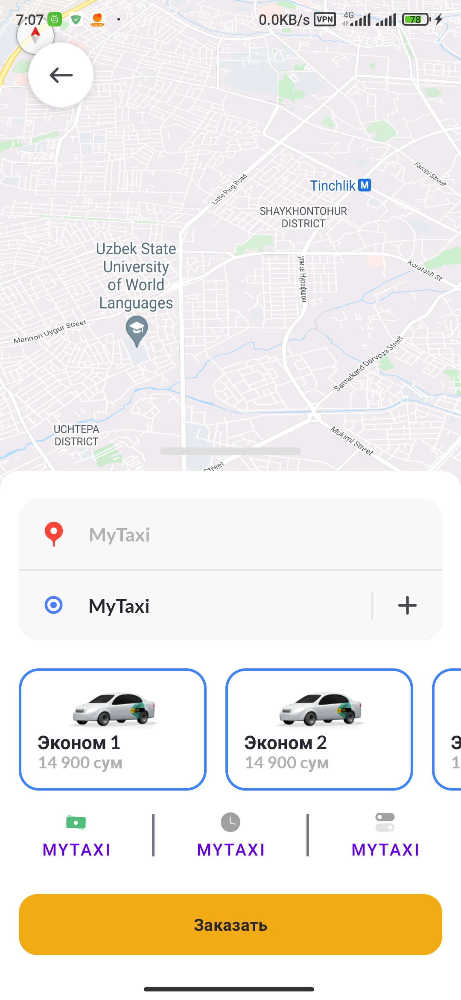

# WIP (work in progress)

## TODO
- [ ] Improvement UI design
- [ ] Implement night theme

## Used libraries
- AndroidX
- Kotlin - Language
- Kotlin Serialization - Json serializer
- Retrofit - Network (HTTP/S)
- Jake Wharton's Timber - for logging
- Pluto - network interceptor
- Room - Database
- Coroutines - MultiThreading
- Coil - for image loading
- Hilt - DI container
- Cicerone - for Bottom Sheet Navigator
- Orbit MVI - Architecture Pattern

 

  
  
  
  

